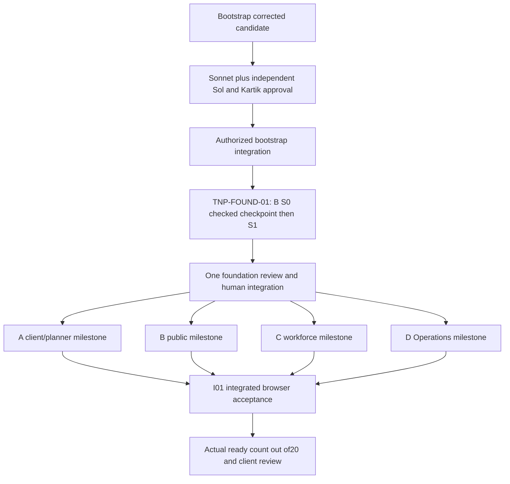

# Delivery milestones and first-three-day dependency graph

Current candidate: tnp-bootstrap-review-04. Review pair: Sonnet + independent Sol. Foundation milestone: TNP-FOUND-01.

Kickoff and Day3 client slot are pending. D1 is agreed kickoff; D25 is D1+24 calendar days. Two humans normally supervise one builder each; four chats do not create four human owners. Dates and scope reductions are not invented.

D1: finish bootstrap gates, then B foundation; no formal review between S0 and S1, but S0 checks must pass before S1. Read-only client/content/domain clarification can proceed. Foundation review follows the completed milestone.
D2–3: after foundation integration, P issues per-lane grouped Ready contracts; initially A and D, then B/C as human capacity permits. Each grouped milestone has one formal review, earlier escalation only for shared-contract/security/domain changes. Slice acceptance remains required. At two waiting reviews or one per human pause further dispatch.
I01 follows integrated A-02/B-01/C-03/D-03 acceptance within their future grouped milestones. Demonstrate same-browser planner -> Operations -> worker -> roster -> attendance -> earnings, plus public enquiry and client quote/collection. Preserve desktop/mobile/keyboard/state evidence. Begin client walkthrough with Operations. Report actual coverage; Day3 target16/20 is frontend coverage, not production completion. If forecast slips, H1 reports shortfall and seeks prioritization; no preapproved cuts.
D4–6: remaining frontend F17 basic RSVP, F18 maintenance, F19 login/tracking/recovery, F20 expenses/reports/audit/settings and feedback.
D4–18: reviewed server contracts/providers/authorization/allocation/attendance/finance in dependency order. Production-sensitive milestones require independent review, not merely preview checks. FreezeDay18.
D19–23 QA/security/race/financial tests, UAT/recovery/rehearsal; planned releaseDay24 after authorization; Day25 buffer/handover. No new publication granted by this plan. Keep reference visuals and current framework through frontend milestone.
