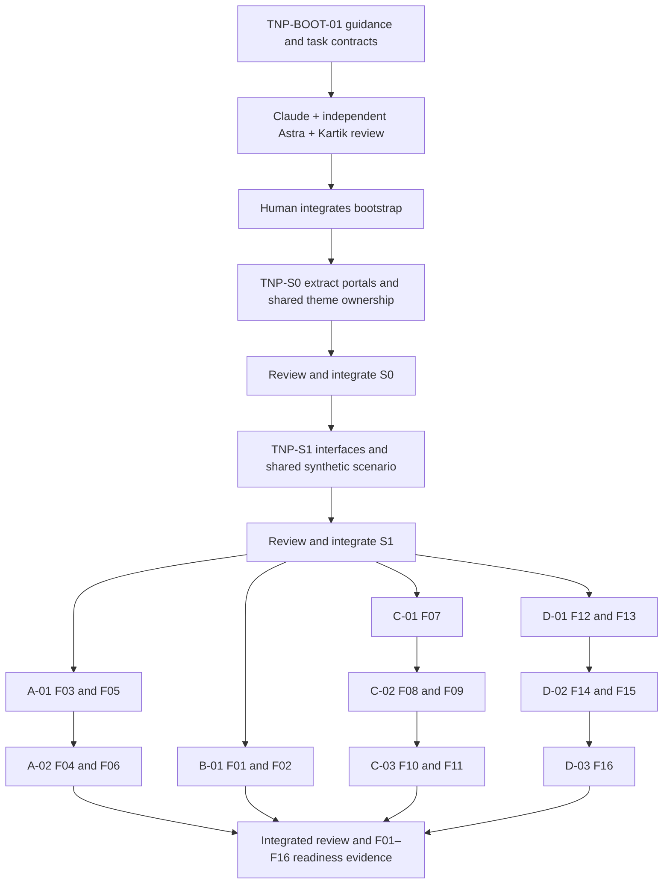

# Two-human delivery and first-three-day dependency graph

Kickoff date and client Day 3 appointment pending. Use D1 = agreed kickoff; D25 = D1 + 24 calendar days. The PDF's 13 October date is historical evidence, not a confirmed appointment.
Human capacity changed from three to two. The old illustrative 63 person-days would be 42 person-days at the same 21 working days each; that is an assumption, not booked availability. Four model lanes do not restore the missing human capacity.
No full-scope feasibility guarantee. H1 owns client/design/demand; H2 now owns workforce plus operations/finance/platform. Collect actual supervision, review, rework and merge throughput on D1–D3 and reforecast. Do not consume QA/release buffer to conceal a scope gap.

## Dependency graph

Every arrow into implementation requires merged commit evidence, not merely a builder's “done”. Reviews for same-lane sequences occur before each merge/next launch.

## Cadence
D1: bootstrap/review, S0/review, S1/review. Read-only client/content and domain clarification can proceed meanwhile. If prerequisites consume D1, explicitly forecast less UI time rather than launching coupled work.
After S1: initially choose A-01 and D-01 (one builder per human); keep B/C prepared. Alternate with B-01/C-01 based on remaining human review windows. Four can run only when both humans can supervise, independent reviews are scheduled, shared ownership is disjoint and queue is below two.
D2: continue short same-lane sequences, opposite-model reviews and at least midday/end-day integration opportunities. Single heavy build per laptop by default.
D3: complete target-set defects, verify desktop/mobile/state coverage, begin client walkthrough with Operations, then demand, then worker. Report actual numerator out of 20. Client approval remains pending if absent. Publication needs separate authorization.
D4–6: accepted feedback and F17 basic RSVP, F18 maintenance, F19 login/tracking/recovery states, F20 expenses/reports/audit/settings. These are backlog entries, not launchable tasks.
D4–18: production contracts, identity/events, safe allocation/confirmation, attendance, finance/provider/reconciliation and remaining scope in dependency order. Feature freeze D18.
D19–23: QA/security/race/finance tests, UAT, recovery/rehearsal/training and go/no-go. D24 planned authorized release. D25 buffer/handover.

## Stop/adjust triggers
Two waiting reviews -> stop new launches. Unresolved critical findings -> block affected merges/dependents. H2 complex financial/security work -> one H2 builder. Missing provider/client decisions -> block affected work only.
Anjaneya is proposed integration captain for frontend milestones; confirm availability before integration. Humans resolve conflicts and authorize exact commits. This bootstrap grants no merge/publication authority.

I01 scheduling: docs/contracts/I01-INTEGRATED-PREVIEW.md is the Day3 post-consumer browser gate; S1 has service-level journey tests and no full-portal browser gate. One waiting review per human also pauses their new dispatch. If throughput cannot deliver 16/20 by the client slot, P/H1 report actual coverage and seek client prioritization; no preapproved screen cuts exist.

Current cadence override: REVIEW-CADENCE.md groups S0 then S1 as TNP-FOUND-01; graph R0 is now a checks/checkpoint step, and R1 is the single foundation formal review/integration. Consumer lane grouping requires explicit milestone contracts.
