# TNP full-platform product and usage blueprint

Status: corrected canonical product-flow direction recorded 2026-09-19. This replaces the earlier model that treated a Planner primarily as an external customer. It describes the intended responsive web platform; it does not claim the current frontend preview has production authentication, persistence, WhatsApp, allocation or payment enforcement.

## 1. What TNP sells

TNP is one hospitality platform with four connected product families.

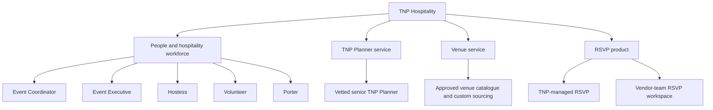

These products may be ordered independently or combined for one event. A client can ask TNP to plan the entire event, provide only a venue, provide one or more workforce roles, add RSVP, or combine all of them.

## 2. People and role definitions

| Actor | Relationship to TNP | Primary purpose | Important distinction |
|---|---|---|---|
| Client owner/team | Customer organization | Buys services and manages its events/orders | Receives quotations for its purchases |
| Client-appointed planner | Client employee/representative or external planner authorized by the client | Orders TNP venue/workforce/RSVP for the client's event | Uses scoped Client workspace permissions; is not a TNP Planner |
| TNP Planner candidate | Experienced applicant seeking the senior TNP Planner role | Submits experience/profile for Admin review | Cannot plan TNP events until approved |
| TNP Planner | Vetted senior TNP member | Owns assigned client events, chooses approved venues and assigns approved workforce | Acts for TNP within an Admin-granted event scope |
| Freelancer/workforce member | Approved TNP worker | Performs Event Coordinator, Event Executive, Hostess, Volunteer, Porter or other approved role | Sees only eligible opportunities and own work/payment |
| Event Coordinator | Senior event-scoped workforce role | Coordinates assigned lower-level event workforce | May rate assigned lower-level workers after the event |
| RSVP vendor owner/team | Paying RSVP customer organization | Runs its own guest communication and reporting workspace | Is isolated from every other RSVP organization |
| Operations/Admin | TNP control function | Reviews accounts/orders, creates quotations, grants scope, manages exceptions and audit | Admin alone issues official quotations |
| Finance | Restricted TNP function | Reviews collections, monthly earnings and payouts | Client collections and freelancer payouts remain separate |

## 3. Public website and workspace entry

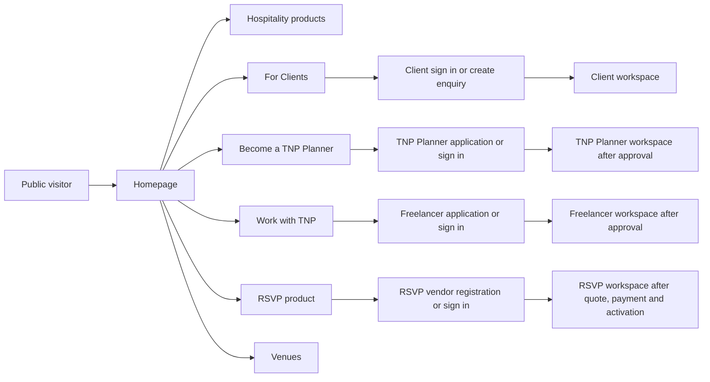

Public pages explain products. Private workspaces execute work. Every public product page has one clear primary action and a secondary `Talk to TNP` option; visitors are never dropped into an editable operational preview.

## 4. Universal product-order and quotation flow

Every paid service begins as an order/request. Price is not silently generated by a browser form.

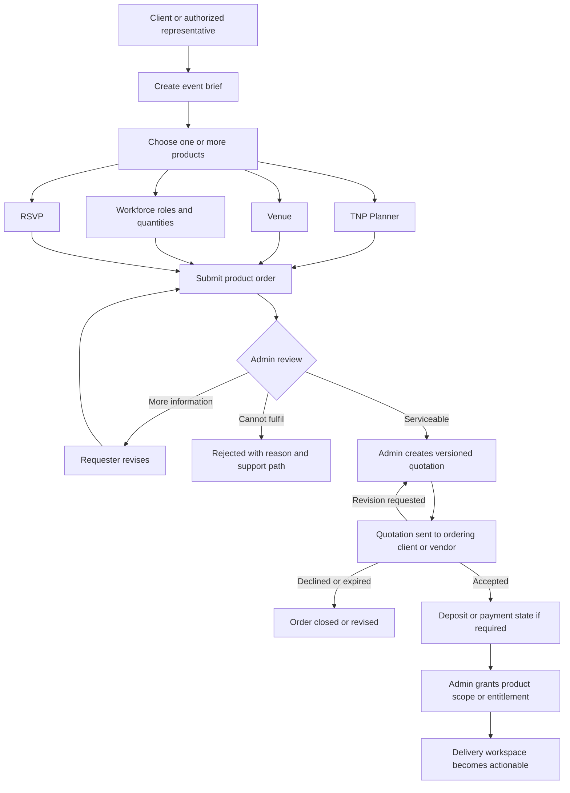

Rules:

- Only authorized Admin/Operations users create or revise official quotations.
- `requestedBy` and `billingParty` are separate. A TNP Planner may request an add-on for an assigned client event, but the authorized client/billing party receives and approves the quotation.
- One order may contain several product lines; each line has its own quantity/scope, quotation lines, approval and fulfillment state.
- A service is not granted merely because a form was submitted or a quotation was viewed.
- Admin grant states what the Planner/Operations team may allocate: event, dates, venue scope, roles, quantities, RSVP entitlement, commercial version and expiry/change rules.

## 5. Client workspace

The Client workspace is a guided event builder and commercial control centre, not a blank dashboard.

### Main navigation

- Overview and `Next best action`
- Create/continue event
- Product catalogue
- My events
- Orders and quotations
- TNP Planner
- Venue
- Workforce
- RSVP
- Documents and reports
- Organization/team
- Support

### Guided event builder

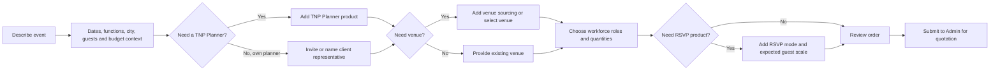

Recommendations explain what each product solves and why it may help; nothing is preselected or added through a dark pattern. The Client can explicitly choose `Not needed` and change a draft before submission.

The first viewport shows event status, product coverage, quotation/payment action, requested changes and the next deadline. Cards use direct names such as `TNP Planner requested`, `Venue awaiting quote`, `5 Event Executives approved`, and `RSVP access active`—not vague slogans.

## 6. Two different Planner concepts

### Client-appointed planner

A client may invite its own planner as an organization member or authorized event representative. That person can prepare event details and order TNP workforce, venue or RSVP for the client, subject to Client organization permissions. The client organization remains the buyer/billing party unless an explicitly approved commercial arrangement says otherwise.

The client-appointed planner does not enter the TNP Planner talent pool, does not receive TNP Planner assignments and cannot use internal TNP allocation privileges.

### TNP Planner

A TNP Planner is a senior TNP role and sellable service. Candidates register with experience evidence and are approved by Admin. Approved TNP Planners receive client-event assignments and a dedicated operational dashboard.

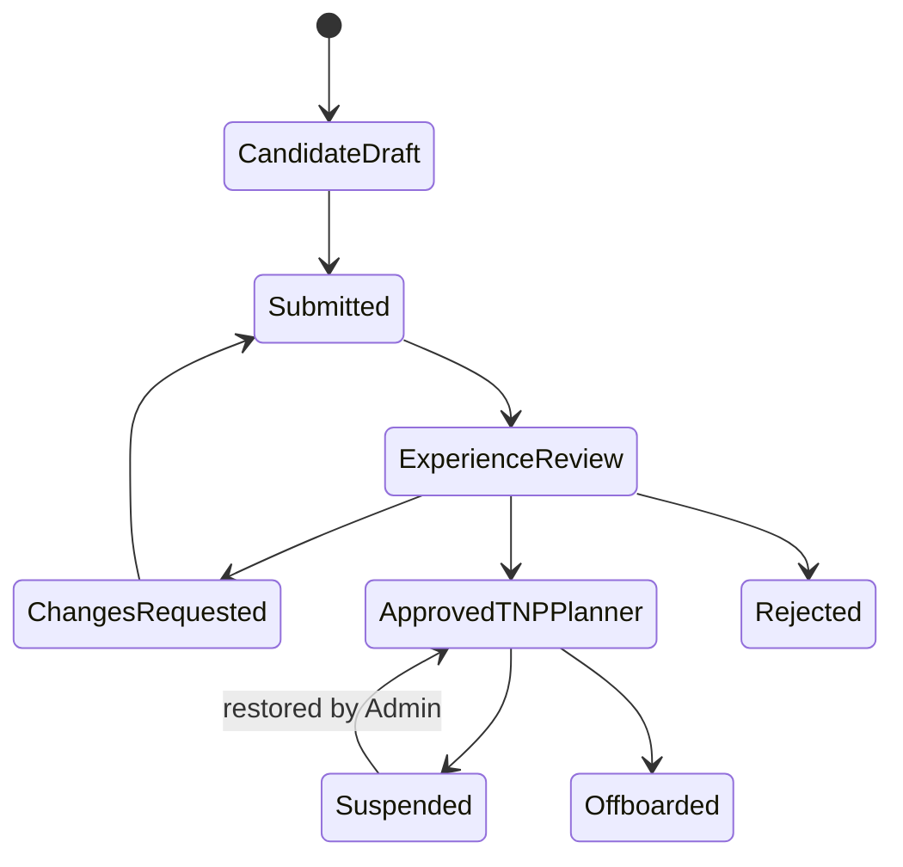

Approval considers client-defined experience, references, cities, specialties, performance and any approved evidence. Registration does not automatically create a TNP staff role.

## 7. TNP Planner assignment and dashboard

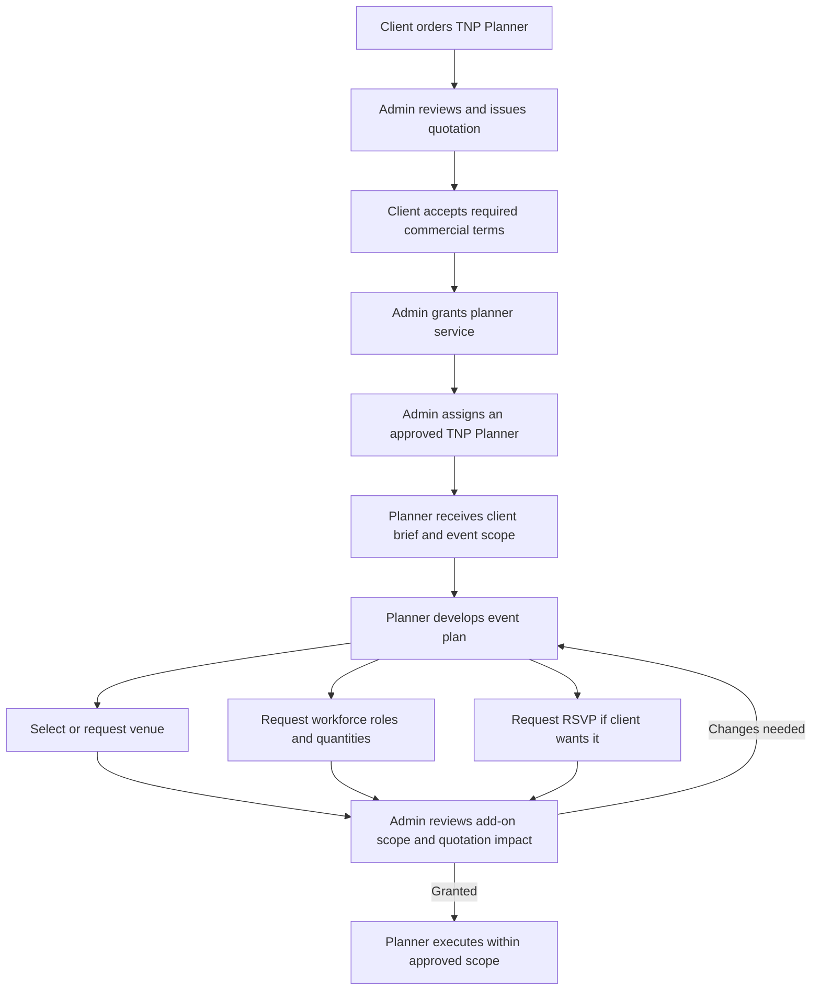

### TNP Planner dashboard

- **Command overview:** assigned events, risks, approvals, deadlines and next action.
- **Client brief:** goals, functions, budget context, contacts, constraints and approved scope.
- **Event plan:** timeline, functions, tasks, dependencies and change history.
- **Venue:** image-led catalogue, evidence, availability state, pricing qualifier, shortlist and assigned venue.
- **Workforce builder:** Event Coordinator, Event Executive, Hostess, Volunteer, Porter and other approved roles with quantity/shift/skills.
- **Approval centre:** submitted resource plan, quotation impact, Admin questions, approved quantities and change requests.
- **Talent board:** eligible applicants/available workers, rating evidence, performance and assignment controls after Admin grant.
- **Assigned team:** accepted, reconfirming, declined, replaced, checked-in and completed states.
- **RSVP:** request/entitlement status and link to the authorized RSVP event/workspace.
- **Client updates:** shareable milestones and decisions without exposing internal/private data.
- **Ratings and closure:** rate assigned workers, review coordinator feedback and produce event closure.
- **Reports:** staffing, attendance summary, resource changes, ratings and final delivery evidence.

The Admin grants scope first. After grant, the assigned TNP Planner may select/assign a venue and freelancers inside that scope. Every assignment still passes the server allocation service for eligibility, quantity, schedule overlap, replacement and audit checks. Admin manages exceptions and may revoke/change scope with a reason; approval is not an unrestricted override.

## 8. Workforce products and hierarchy

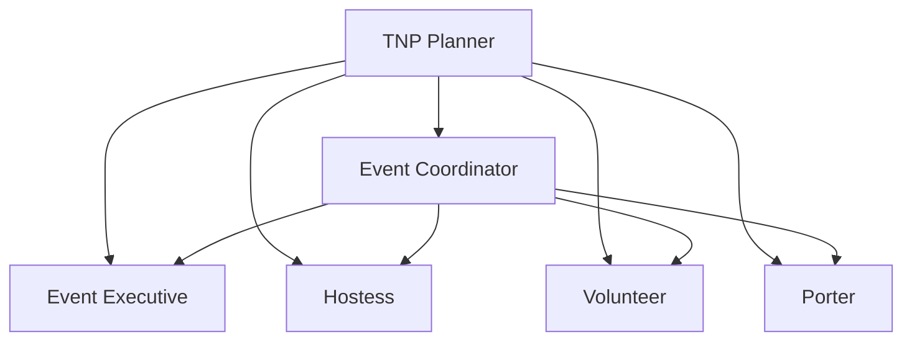

This is operational supervision and rating authority within an assigned event, not a universal account hierarchy. A person can hold only roles explicitly approved for that assignment.

One event/resource plan supports multiple lines:

| Role | Quantity | Shift | Example need |
|---|---:|---|---|
| Event Coordinator | 1 | Full event | Team coordination and escalation |
| Event Executive | 5 | 10:00–20:00 | Guest flow and execution |
| Hostess | 3 | 16:00–22:00 | Welcome/registration |
| Volunteer | 8 | 08:00–18:00 | General event support |
| Porter | 4 | 07:00–15:00 | Luggage/material movement |

The role catalogue, allowed supervision graph, day/shift definition, skills, uniform and service rates require client approval.

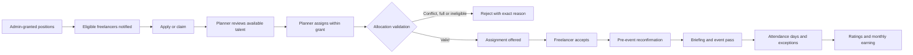

## 9. Rating and review model

- The assigned TNP Planner may rate workforce assigned to that Planner's event.
- The assigned Event Coordinator may rate assigned lower-level roles: Event Executive, Hostess, Volunteer, Porter and other client-approved subordinate roles.
- A rating is event/assignment scoped; no cross-event or unrelated-person rating is permitted.
- Only completed/eligible attendance can open a rating action unless Admin records a reasoned exception.
- Show rating average, count, dimensions and relevant written reviews only with source and status.
- Corrections/disputes preserve the original and append reviewer, reason and time.
- Poor ratings trigger human review; they do not silently create permanent deactivation.

Still required from the client: rating scale, dimensions, weighting between Planner and Coordinator, publication rules, dispute period, minimum counts and eligibility impact.

## 10. Freelancer workspace and monthly payment

The Freelancer workspace contains application/approval, eligible opportunities, assignments, briefing/pass, attendance calendar, ratings/standing, monthly statements, payout history and support.

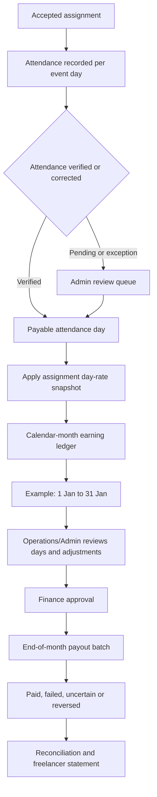

If a freelancer works five events covering twenty verified payable days in January, the January statement uses those twenty approved day entries and their captured day rates. The platform must not infer pay from event count alone.

Pending policy: whether two separate assignments on the same calendar date create one payable day, two shifts or overtime; partial days; overnight events; cancellation pay; overtime; allowances; deductions; cutoff timezone; and late corrections.

## 11. RSVP as a separate paid product

RSVP is a detailed WhatsApp-connected product, not a small add-on screen. It supports two activation paths.

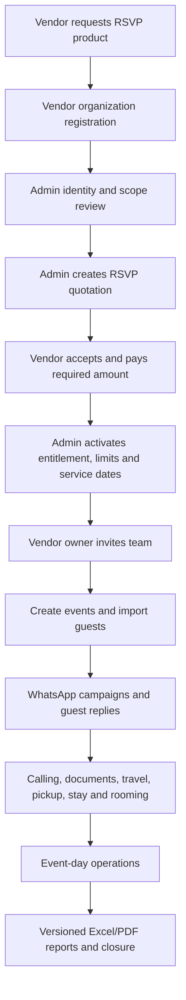

A Client, client-appointed planner or assigned TNP Planner may request RSVP for an existing event. Admin creates/revises the quotation for the event's billing party, then grants the RSVP engagement. TNP staff or the authorized customer/vendor team operates it according to the selected mode.

The detailed workspace includes event/functions, guest/household directory, function-wise responses, WhatsApp inbox, calling queue, conditional forms, approved document desk, travel/pickup/drop, hotels/rooming, campaigns, attention queues, exports, team permissions, subscription/usage and support.

The full operational specification remains in [RSVP-SERVICE-BLUEPRINT.md](RSVP-SERVICE-BLUEPRINT.md). Real WhatsApp, documents and guest data require provider approval, consent, private storage, tenant isolation, durable jobs and audit.

## 12. Operations/Admin workspace

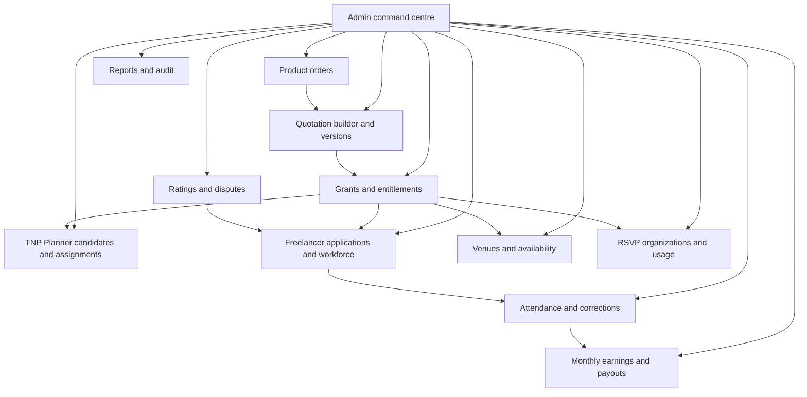

The Admin landing view prioritizes queues: orders awaiting review, quotations awaiting action, expiring grants, staffing shortages, attendance exceptions, rating disputes, RSVP provider failures and payout reconciliation. Summary metrics come after actionable risk.

## 13. Core status models

- **Product order:** `draft → submitted → under review → information requested → quoted → revision requested / accepted / declined / expired → payment pending where required → granted → in delivery → completed / cancelled`.
- **Quotation:** `draft by Admin → issued version → client/vendor viewed → revision requested / accepted / declined / expired → superseded`.
- **Grant/entitlement:** `pending → active → changed → suspended → expired → completed → revoked`.
- **Assignment:** `available → applied/claimed → assigned → accepted → reconfirming → confirmed → declined/nonresponse/replaced → attended/exception → completed`.
- **Monthly earning:** `estimated → attendance pending → calculated → Operations reviewed → Finance approved → batched → processing → paid / failed / uncertain / reversed`.

## 14. Data relationship map

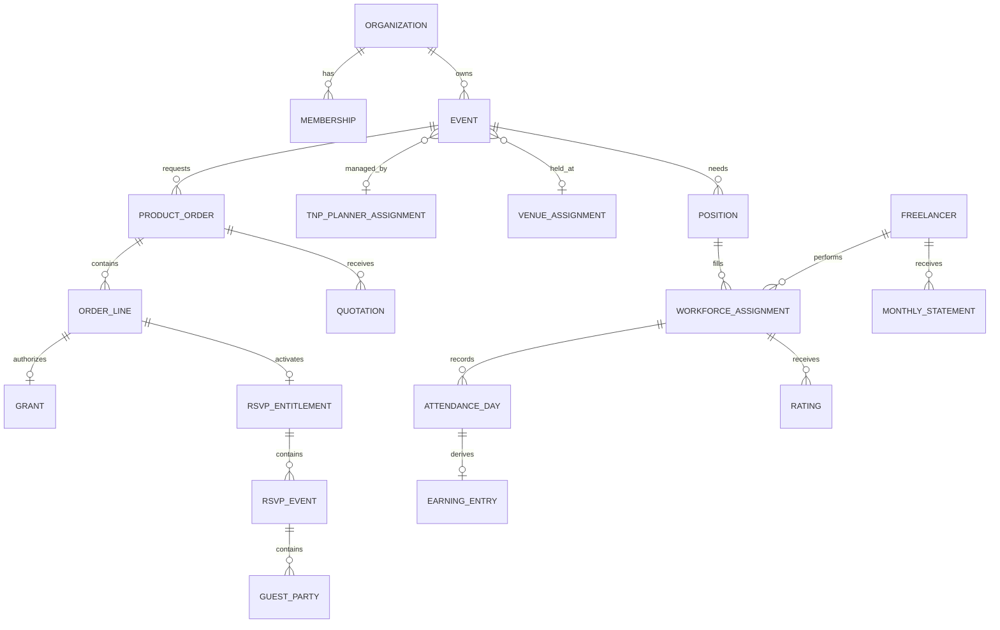

## 15. Frontend information architecture and polish

- Use `#008080` as the brand primary with ivory/champagne support; native cursor outside the homepage.
- Each workspace opens with identity, current event/organization, status and one dominant next action.
- Buttons use concrete verbs: `Request quotation`, `Add workforce role`, `Submit to Admin`, `Assign worker`, `Approve quotation`, `Activate RSVP`.
- Product names and task names visually outrank step numbers and marketing slogans.
- Use compact desktop density, body-family tabular numerals and visible click targets.
- Show process steppers where they explain order → quotation → grant → delivery.
- Prefer list-detail and work queues over walls of equal statistic cards.
- Provide loading, empty, filtered-empty, error, retry, permission-denied, expired, suspended and revision-requested states.
- Motion explains state changes and spatial transitions; it never hides an action or implies a server save/send.

Client product cards show TNP Planner, Venue, each workforce product and RSVP with image/illustration, use case, inclusions, current order state and one action. Workforce products are never collapsed into a vague `freelancers` product.

Planner talent cards show professional evidence, consented imagery, skills, relevant rating count and event availability without private documents or financial data. Venue cards use provenance-labelled imagery, location, capacity, pricing qualifier and availability evidence. RSVP is an entitlement/product card, not a partner card.

## 16. Production boundaries and failure rules

- Server derives user, organization, role, event and grant scope; client IDs never grant access.
- Only Admin quotation actions create official quotation versions.
- Planner assignment stays inside the Admin grant and uses the single allocation service.
- Venue/workforce cannot appear assigned until persistence succeeds.
- Rating authority is event/assignment scoped and auditable.
- Attendance correction preserves original evidence and recalculates only unfinalized earnings; later corrections create review/adjustment.
- Calendar-month payout cannot pay the same payable entry twice.
- RSVP organizations, guests, documents, messages and exports remain tenant isolated.
- WhatsApp submitted/sent/delivered/read/replied and RSVP confirmed remain separate states.
- Failed, uncertain and reversed collections/payouts require reconciliation.

## 17. Recommended delivery sequence

1. Integrate already completed/reviewing frontend candidates without rewriting them in place.
2. Shared UX/access foundation: public versus workspace routes, demo identities, navigation, cursor, buttons, number type and non-obscuring preview chrome.
3. Product catalogue and Client guided event builder with order/quotation/grant states.
4. Distinguish client-appointed planner permissions from TNP Planner candidate/approved role.
5. TNP Planner application, assignment and large dashboard shell.
6. Multi-product order lines, Admin-only quotation UI and grant centre.
7. Venue/workforce resource planning and Planner assignment within grant.
8. Freelancer opportunities, attendance, rating hierarchy and monthly statement UI.
9. RSVP order/entitlement integration plus detailed RSVP product batches.
10. Aggregate responsive, keyboard, privacy, permission, error, security, finance and UAT verification.
11. Homepage final refinement last.

## 18. Client decisions still required

1. Exact public names/descriptions for the four product families and each workforce role.
2. TNP Planner experience threshold, evidence, review/reapplication and suspension policy.
3. Client-appointed planner invitation/permissions and who becomes the billing party.
4. Which products may be ordered independently and which require prerequisites.
5. Admin quotation approvers, quote expiry, deposits and grant conditions.
6. Venue catalogue/custom sourcing, availability and commercial evidence rules.
7. Planner assignment limits within a grant and Admin exception policy.
8. Workforce supervision graph, rating scale/weighting/dispute/publication rules.
9. Day/shift/overtime/overnight/cancellation and same-date multiple-assignment payment rules.
10. Monthly cutoff timezone, late attendance/correction and payout release date.
11. RSVP packages, limits, vendor payment/activation, sender mode, WhatsApp provider and guest-document policy.
12. Client product recommendations, approved copy, imagery and UAT scenarios.

The full collection list is [CLIENT-INPUTS-AND-ACCESS-REGISTER.md](CLIENT-INPUTS-AND-ACCESS-REGISTER.md).
