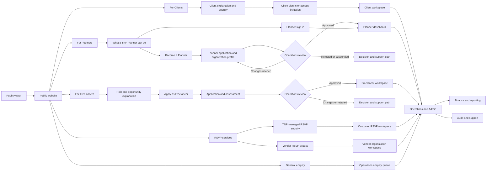
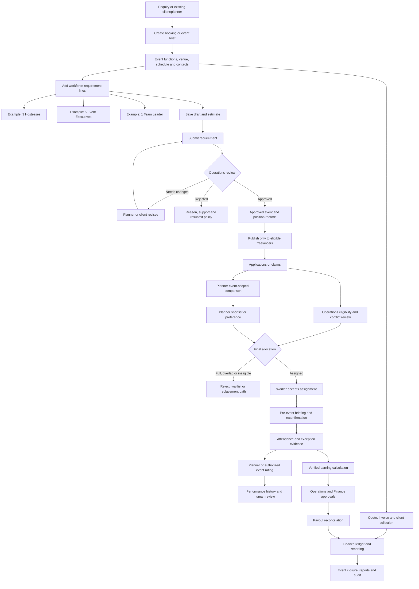
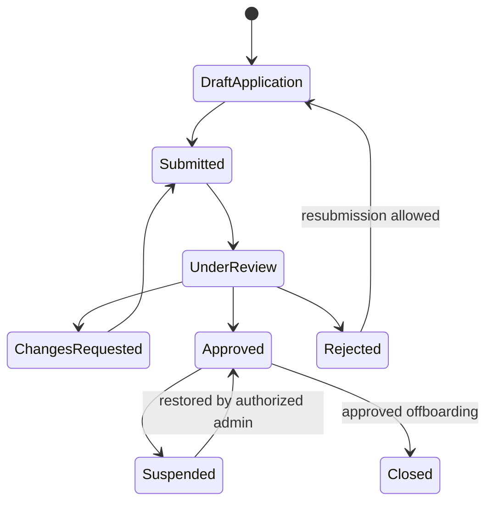
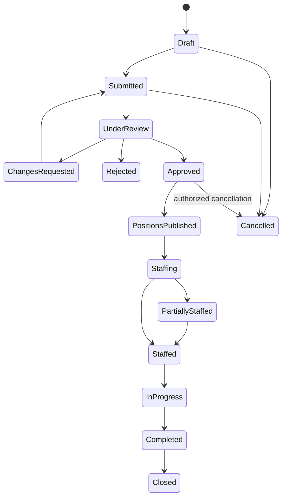
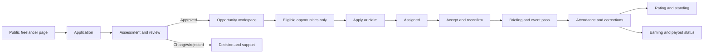
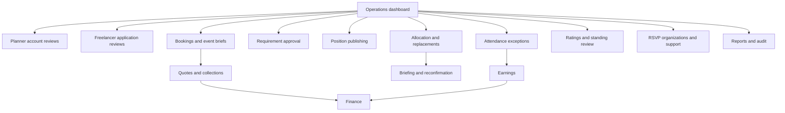
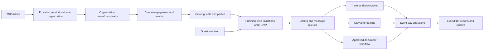
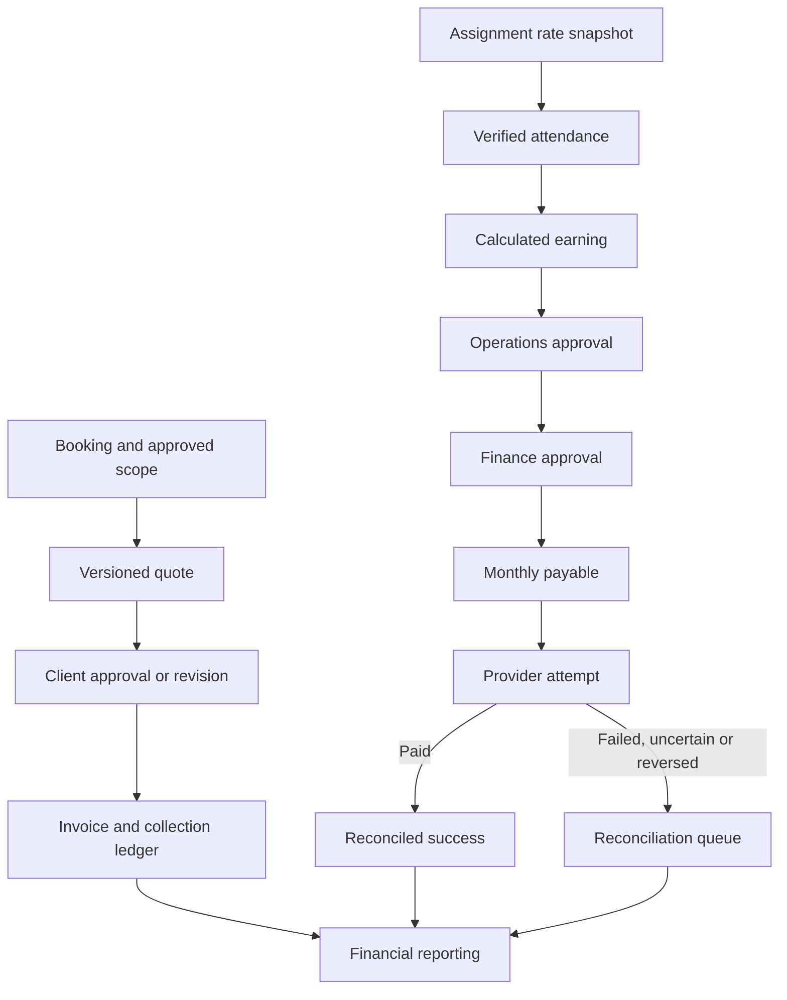
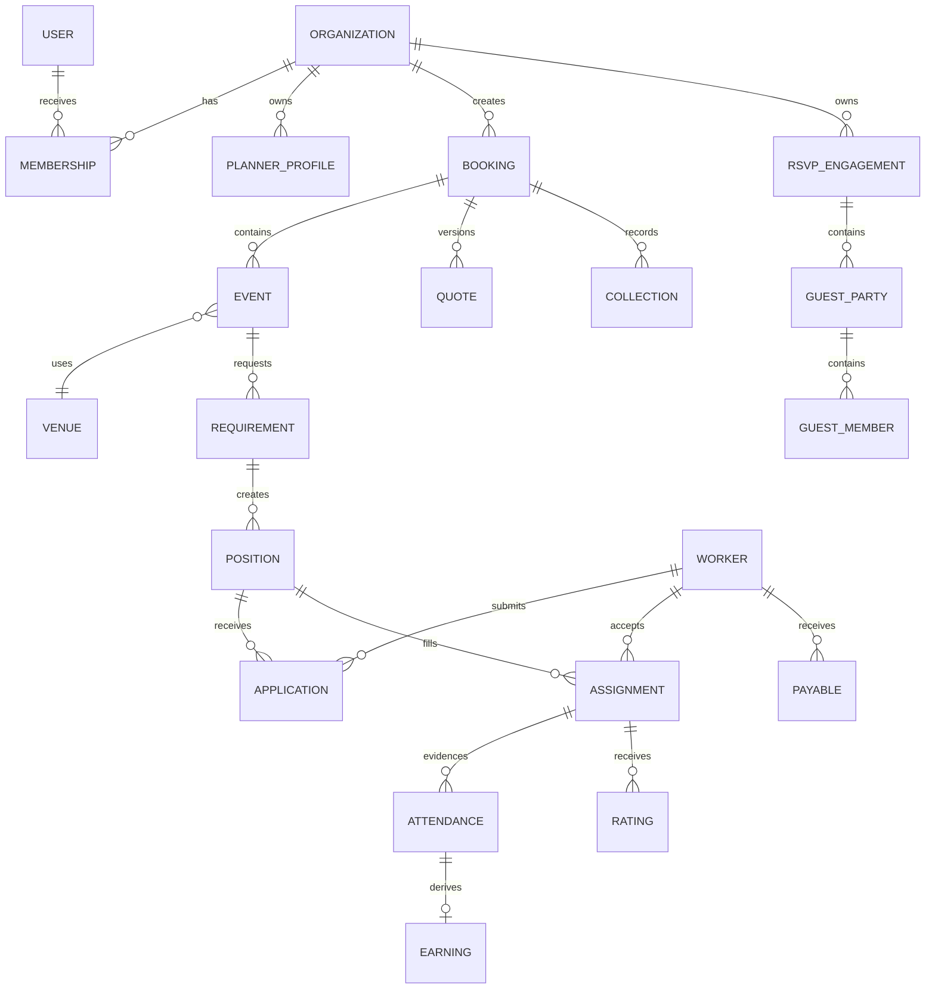

# TNP full-platform usage and workflow blueprint

Status: product-flow blueprint for client refinement, recorded 2026-09-19. It defines the intended responsive-web experience and trust boundaries. It does not claim that production authentication, database persistence, notifications, allocation, payments or provider integrations are already implemented.

## 1. Platform in one view

The public website explains and converts. The authenticated workspaces execute. Operations/Admin coordinates the shared record, approvals and exceptions. Finance owns financial effects. RSVP has its own event/guest permissions but shares the platform identity boundary.

## 2. Entry and access model

| Audience | Public experience | Access action | Authenticated destination | What must never happen |
|---|---|---|---|---|
| Client | Services, venues/planners, process, enquiry | Sign in or use invitation | Client workspace | Public page exposing private quote, booking or guest data |
| Planner | Clear explanation of benefits, requirements and process | `Become a Planner` or `Planner sign in` | Planner application/status/dashboard | Sending every visitor directly into an editable planner workspace |
| Freelancer | Roles, eligibility, process and expectations | `Apply as Freelancer` or `Freelancer sign in` | Application/status/opportunity workspace | Showing restricted event details before eligibility |
| RSVP customer | Managed-service explanation | Enquire or open customer invitation | Customer RSVP workspace | Treating a guest invitation as staff access |
| RSVP vendor | Vendor product, limits and onboarding | Request access or sign in | Vendor organization workspace | Cross-vendor guest/event visibility |
| TNP staff | No public operational controls | Staff sign in with stronger security | Operations/Admin/Finance | Publishing synthetic Operations records as public content |

Demo profiles may reproduce these journeys using clearly labelled synthetic data. Demo selection is not production authentication.

## 3. Complete event lifecycle

The Planner's demand, Operations staffing records, Freelancer assignments, attendance, ratings and finance records remain connected by stable booking/event/position IDs. A dashboard is a view of this record; it is not a separate copy of the truth.

## 4. Planner journey in detail

### 4.1 Before login

`/planner` is a public Planner landing page, not the private dashboard. It should answer:

1. Who qualifies as a Planner or planning company?
2. What can they request from TNP?
3. How approval works and what documents/details are needed.
4. What they can see after approval.
5. What TNP Operations still controls.

Primary actions: `Become a Planner` and `Planner sign in`. A third, lower-priority action may be `Talk to TNP`.

### 4.2 Planner account lifecycle

Account approval and requirement approval are intentionally separate. An approved Planner may create requests, but each submitted event/workforce request still receives operational review.

### 4.3 Planner onboarding fields

- Planner/company name, legal/operating type and cities served.
- Primary contact and organization members.
- Experience, event categories, portfolio/reference evidence and service areas.
- Billing identity and address when commercial flow begins.
- Required declarations/terms acceptance.
- Documents only after client-approved purpose, storage, access and retention rules exist.

### 4.4 Planner event and workforce composer

One event brief contains:

- event name, client/reference and one or more functions;
- venue selection or custom venue request, city, address/reporting point and map instructions;
- date, timezone, start/end, setup/travel buffers and guest scale;
- on-site contacts, dress code, languages, briefing and accessibility needs;
- multiple workforce lines, each with role, quantity, shift, skill/experience, language, gender only if lawful and explicitly approved, uniform and notes;
- attachments/briefs only through approved private storage;
- estimate/quote state, acknowledgement and change history.

The interface supports adding, duplicating, editing and removing several workforce lines before one submission. It must not force the Planner to submit `3 Hostesses` and `5 Event Executives` as unrelated event requests.

### 4.5 Requirement lifecycle

### 4.6 Planner dashboard

The approved Planner dashboard is a substantial workspace with:

- **Overview:** next action, account state, pending approvals, upcoming events and staffing risk.
- **Events:** draft, submitted, approved, staffing, live, completed and cancelled events.
- **Workforce requests:** multi-line demand, change requests, approval history and fill progress.
- **Applicants:** event-scoped applicants/eligible candidates with comparison and shortlist tools.
- **Assigned team:** confirmed/reconfirming/declined/replacement states and briefing acknowledgement.
- **Venues:** approved catalogue or custom venue record, evidence-rich cards and selected event venue.
- **Quotes and invoices:** versions, approval/revision, deposits/collections and downloadable approved documents.
- **Messages/notifications:** request decisions, staffing changes, reconfirmation risk and event updates.
- **Reviews:** submit event-specific worker feedback and view allowed history.
- **Reports:** event staffing, attendance summary, ratings and closure report.
- **Organization settings:** team members, permissions, contact/billing profile and audit-visible changes.

### 4.7 What a Planner can see about applicants

Recommended event-scoped comparison card:

- approved display name and profile image if consented;
- role/skills, city/service area and relevant experience;
- aggregate rating with count and scale;
- recent relevant event-performance summaries;
- attendance/reliability indicators with defined calculation period;
- verified badges only when issuer and verification state exist;
- availability/overlap result and application state;
- Planner's shortlist/preference action.

Never expose private KYC documents, bank details, home address, internal disciplinary notes, unrelated-event client names, exact payout data or unrestricted phone/email. Operations can see the additional information required for legitimate administration under role and audit controls.

### 4.8 Who selects the final worker

Recommended v1 decision: the Planner can shortlist, rank or approve preferences; Operations performs final allocation. This preserves capacity, eligibility, overlapping-event and replacement integrity. If the client wants the Planner to make final assignments, that requires a separately approved permission and server-side allocation design—the UI alone cannot make it safe.

## 5. Client workflow

```mermaid
flowchart LR
    A[Public client page] --> B[Enquiry or access invitation]
    B --> C[Client workspace]
    C --> D[Create or review booking]
    D --> E[Choose venue/planner or provide own]
    E --> F[Functions and service requirements]
    F --> G[Quote issued]
    G -->|Revision requested| F
    G -->|Approved| H[Collection and delivery milestones]
    H --> I[Event progress and approved reports]
    I --> J[Closure and feedback]
```

Clients see their own bookings, quotes, collections, approved staffing summaries and reports. They do not automatically receive worker KYC, payroll or other clients' data.

## 6. Freelancer workflow

Opportunity visibility is filtered by active status, role, availability, rating/location policy and event scope. Application does not guarantee assignment.

## 7. Operations and Admin workflow

Operations is not one unlimited super-screen. Permissions should separate platform administration, operations, workforce review, event coordination and finance.

Every sensitive decision records actor, time, reason, before/after state and related event/account IDs. Admin override cannot silently bypass capacity or overlap rules.

## 8. RSVP usage structure

Vendor/customer organizations are isolated. Guest invitation links are not employee logins. Hotel and transport contacts receive only the minimum assigned information.

## 9. Finance usage structure

Client collections and freelancer payouts are separate ledgers. Money uses integer paise. No ambiguous provider response becomes a successful payment without reconciliation.

## 10. Responsibility and visibility matrix

| Capability | Client | Planner | Freelancer | Operations | Finance | RSVP vendor/customer |
|---|---:|---:|---:|---:|---:|---:|
| Public information/enquiry | Yes | Yes | Yes | Staff contact only | No | Yes |
| Own organization/profile | Own | Own | Own person | Scoped administration | Scoped | Own organization |
| Create booking/event brief | Own | Own | No | On behalf with audit | Read as needed | RSVP events only |
| Add multi-role workforce demand | Own if enabled | Yes | No | Yes | No | No unless separately sold |
| Approve Planner/Freelancer accounts | No | No | No | Authorized reviewer | No | Vendor members only within scope |
| Publish positions/final allocation | No | Preference only | Apply/accept | Yes | No | No |
| View applicant comparison | Approved scope | Event scope | Self only | Authorized scope | No | No |
| View KYC/private workforce data | No | No | Own only | Restricted authorized role | Minimum needed | No |
| Record attendance | No | Optional event evidence only | Self evidence if allowed | Authorized event actor | Read approved | RSVP check-in is separate |
| Rate worker/event | Own event if approved | Own event | View own | Review/correct with audit | No | Guest-service feedback only |
| Approve earnings/payouts | No | No | View own | First approval if policy confirms | Final approval/provider | No |
| Guest/document operations | Own engagement scope | No by default | No | Audited support scope | Commercial summary only | Own organization/event scope |

## 11. Main records and relationships

## 12. Failure and exception paths that must remain visible

- Unauthenticated, wrong-role and wrong-organization access fails closed.
- Planner account approval and requirement approval can be pending, changed, rejected, suspended or restored.
- A requirement may be partly staffed; the dashboard must not call it complete.
- Full capacity, schedule overlap, ineligibility and expired reconfirmation are different outcomes.
- Applicant withdrawal, worker decline and Operations replacement preserve history.
- Missing GPS, outside-radius evidence and no attendance are different states.
- Rating dispute and human review do not automatically erase a worker.
- Quote revision and approval operate on explicit versions.
- Payment/payout failed, uncertain, reversed and paid are distinct.
- RSVP sent, delivered, read, replied and confirmed are distinct.
- Every list needs loading, empty, error, retry, filtered-empty and permission-denied states.

## 13. Delivery boundaries

### Current frontend preview

Can demonstrate labelled synthetic profiles, forms, statuses, connected IDs and responsive dashboards. It cannot prove production login, authorization, concurrency-safe staffing, real notifications, private files or money movement.

### Production platform

Requires server-derived identity and organization scope, versioned APIs, MongoDB persistence, allocation transactions/conflict controls, private storage, durable jobs, provider adapters, audit, backup/restore, monitoring and UAT.

### Recommended implementation order

1. Public role pages and truthful demo access foundation.
2. Production identity, organizations, memberships and permissions.
3. Planner public page, application/status and approved dashboard shell.
4. Booking/event/venue and multi-line workforce requirement contracts.
5. Operations account/request review and position publishing.
6. Freelancer eligibility/application/allocation and Planner comparison view.
7. Briefing, reconfirmation, attendance, ratings and event closure.
8. Quotes/collections and attendance-derived earnings/payouts.
9. RSVP provider/document/logistics batches.
10. Aggregate security, accessibility, performance, restore, UAT and release gates.

## 14. Client decisions needed to refine this blueprint

1. Can an individual Planner register, or only a planning company/organization?
2. What evidence is mandatory before Planner approval, and may rejected applicants reapply?
3. Can approved Planners create new events directly, or only work on Client/TNP-created bookings?
4. Can a Planner enter a custom venue, select only TNP-listed venues, or both?
5. Does a workforce request require a quote/deposit before positions are published?
6. Does the Planner only shortlist, or may the Planner make final worker assignments?
7. Which worker fields and performance periods may a Planner see?
8. Who may rate workers: Planner, Client, Team Leader, Operations, or a combination?
9. How are disputed ratings corrected, and what rating affects eligibility?
10. Who may invite additional users into a Planner organization, and which roles exist there?
11. Which notifications use email, WhatsApp, in-app or manual follow-up?
12. What is the approved cancellation/replacement policy and timing?

The collection package for these decisions and all assets/accounts is [CLIENT-INPUTS-AND-ACCESS-REGISTER.md](CLIENT-INPUTS-AND-ACCESS-REGISTER.md).
