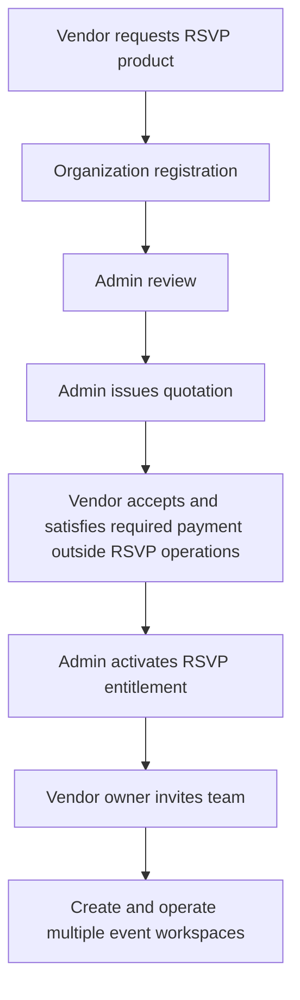
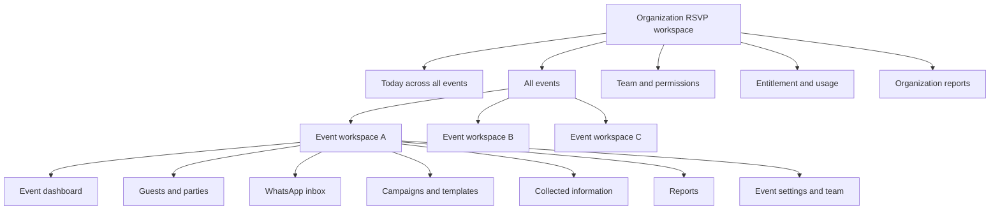
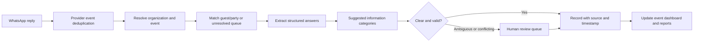
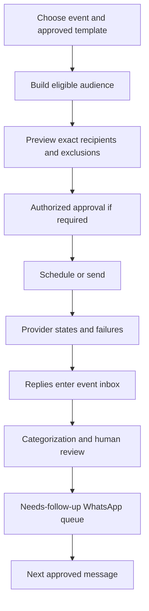

# TNP RSVP message and information service blueprint

Status: corrected canonical RSVP product direction, 2026-09-19. RSVP is a separately sold, multi-event WhatsApp messaging and information-collection product. It is not a phone-calling system, travel/hotel/vehicle booking engine, dispatch system or payment processor.

The current reviewed RSVP frontend candidate was built against a broader earlier scope. Its organization isolation, guest import, messaging concepts, event context, reports and visual foundation remain useful, but its Calls, vehicle dispatch, room inventory/allocation and operational booking behavior are not current product acceptance. A bounded correction milestone is required before integration.

## 1. Product purpose

RSVP helps an authorized vendor or TNP event team:

- operate many events every day from one organization account;
- send approved WhatsApp messages and forms;
- receive and reconcile guest replies;
- organize guests by event, function, household/party and reply status;
- collect travel, pickup/drop, stay, dietary, accessibility and other requested information;
- identify missing, conflicting or ambiguous answers;
- follow up by WhatsApp message;
- generate controlled event reports for the people who perform real-world booking and operations.

Real people book hotels, rooms, tickets, vehicles or other services outside this RSVP app. Real-world supplier payments and guest/client payments are also outside this RSVP app. The product records information needs and communication status; it does not claim inventory, reservation, dispatch or payment authority.

## 2. Activation paths

### Vendor-operated product

### TNP-managed event

A Client, client-appointed planner or assigned TNP Planner may request RSVP for an existing TNP event. Admin sends the product quotation to the event's billing party and grants the RSVP engagement. Authorized TNP/vendor team members then operate the same message-and-information workspace model.

Request, quotation acceptance, commercial payment state and entitlement activation remain separate records. RSVP workspace actions do not process the commercial payment.

## 3. Workspace hierarchy

One organization login can manage many events. Do not create a disconnected application or password for every event.

### Organization-level daily dashboard

The initial dashboard answers, across all active events:

- Which events are active today, upcoming or overdue?
- How many guests replied, remain unanswered or need review?
- Which messages failed, are scheduled or require approved retry?
- Which events have unresolved RSVP, party, travel, pickup/drop or stay information?
- Which event changed since the operator last opened it?
- Which team member owns each WhatsApp follow-up queue?

Each event card shows event name, date/functions, reply progress, needs-attention reasons, latest change and one clear `Open event workspace` action.

### Event workspace

Each event has its own URL and persistent event context. Recommended sections:

1. **Overview:** function-wise RSVP, unanswered, ambiguous replies, failed messages, changes and next action.
2. **Guests & parties:** households and people kept separate, function invitations, search/filter, tags and history.
3. **WhatsApp inbox:** event-scoped conversations, delivery/reply states, ownership, unread and needs-review.
4. **Campaigns:** approved template, audience preview, schedule, send state, failure/retry and opt-out suppression.
5. **Information:** collected travel/stay/pickup/dietary/accessibility answers and missing/conflicting values.
6. **Reports:** versioned guest, response, travel-needs, stay-needs, pickup-needs, message and change reports.
7. **Event team/settings:** scoped membership, functions, approved sender/template state and audit.

Changing events clears event-local selection and filters so no guest, reply or report from the previous event remains visible.

## 4. WhatsApp-only communication

- No phone/mobile call queue, call button, call outcome or caller-performance feature.
- Follow-up is by WhatsApp message only, using approved templates where required.
- Operators may own message queues so two people do not message the same guest unnecessarily.
- Messaging states remain distinct: draft, scheduled, queued, submitted, sent, delivered, read-if-known, failed, uncertain and replied.
- None of those delivery states means the guest confirmed attendance.
- Opt-out, wrong-number, blocked and do-not-contact states suppress future sends according to policy.
- Provider-disabled preview UI must never claim a message was actually sent.

## 5. Reply collection and guest segregation

The app collects and organizes guest information from structured WhatsApp replies, approved forms/buttons and operator-confirmed interpretation of free text.

Suggested categories:

- function-wise RSVP: awaiting, confirmed, tentative, declined or cancelled;
- household/party members and accompanying count;
- dietary or accessibility needs;
- arrival/departure mode, date, time, origin/destination and reference if supplied;
- pickup/drop required, not required or details pending;
- stay required, not required, dates, people and preferences;
- VIP/service tags supplied by authorized staff;
- question/support request;
- unknown, ambiguous or conflicting information.

Automatic/rule-assisted categorization is a suggestion, not an irreversible decision. Ambiguous free text, shared phone numbers, contradictory answers and sensitive changes require an operator to confirm the correct guest, event and category. Preserve the original message alongside any structured interpretation.

## 6. Guest and party model

- A household/party may share a phone number but contains distinct people.
- RSVP is recorded per invited function and person/party rule; one family reply is not automatically one attendee.
- `Awaiting confirmation` is not `Declined`.
- Delivery/read/reply and attendance answers are separate dimensions.
- A guest may revise an earlier answer; history records old/new, source, actor and time.
- Duplicate suggestions never silently merge guests.
- One phone number across events never authorizes cross-event data merging.

## 7. Information collection, not booking

### Travel information

Collect only what the approved event asks for: arrival/departure mode, date/time, origin/destination, reference, pickup/drop need and notes. Show missing/conflicting/changed information and export it for the human operations team.

Do not search fares, reserve tickets, allocate vehicles, dispatch drivers, enforce vehicle capacity or record a provider payment.

### Stay information

Collect stay required/not required, check-in/out dates, party size, preferences, accessibility and notes. Show missing/conflicting/changed answers and export them for the human hotel/operations team.

Do not expose hotel inventory, hold rooms, allocate room numbers, book accommodation, calculate supplier charges or take payment.

### External outcomes

If the client later wants staff to record that a real-world booking was completed elsewhere, a separately approved read-only reference/status field may be added. It cannot become an inventory, reservation or payment workflow without a new product decision.

## 8. Event/function and reply dimensions

| Dimension | Example values |
|---|---|
| Invitation | draft, approved, scheduled, sent, delivered, failed |
| Contact/reply | unanswered, replied, needs review, resolved |
| RSVP per function | awaiting, confirmed, tentative, declined, cancelled |
| Party | primary contact, members, accompanying count, adults/children if approved |
| Travel information | not requested, missing, partial, complete, changed, conflicting |
| Pickup/drop need | not requested, not required, required, details pending |
| Stay need | not requested, not required, required, dates/details pending |
| Dietary/accessibility | none reported, provided, needs review |
| Message permission | eligible, opted out, wrong number, blocked, do not contact |
| Review | clear, ambiguous, duplicate candidate, cross-event conflict |

## 9. Campaign and follow-up workflow

Audience selection uses current event/function invitation, contact permission, response state and previous message state. Retry is idempotent and cannot double-send a successful provider request.

## 10. Reports

Reports are controlled snapshots, not editable booking sheets.

- event/function guest counts;
- confirmed/tentative/declined/unanswered;
- reply and needs-review queue;
- party/accompanying summary;
- dietary/accessibility information;
- travel-information summary;
- pickup/drop-needs summary;
- stay-needs summary;
- message delivery/failure/opt-out summary;
- daily changes and unresolved information;
- event closure communication report.

Every export includes organization/event, filters, record count, timezone, generated-at, revision and exporter. CSV/Excel output neutralizes formula injection. A report revision is immutable or visibly invalidated when its source scope changes.

## 11. Permissions and isolation

- TNP Admin: organization entitlement, suspension/reactivation, limits and audited support.
- Vendor owner: own organization, team and all authorized events.
- Event manager: assigned events, guests, messages, information and reports.
- Message operator: assigned event inbox/campaign/follow-up scope.
- Client viewer/approver: explicitly shared event summaries, campaigns or reports.
- Guest: expiring/revocable invitation/reply scope for the authorized party/event only.

Every read, write, export and provider event is organization- and event-scoped. Direct IDs, phone numbers and message provider IDs never grant access.

## 12. Core records

`VendorOrganization`, `OrganizationMembership`, `AccessEntitlement`, `RSVPEventWorkspace`, `FunctionEvent`, `GuestParty`, `GuestMember`, `Invitation`, `FunctionResponse`, `WhatsAppConnection`, `Conversation`, `Message`, `ReplyInterpretation`, `InformationAnswer`, `Campaign`, `TemplateApprovalState`, `FollowUpTask`, `ImportBatch`, `ExportSnapshot` and `AuditEvent`.

The corrected core does not contain `CallAttempt`, live `HotelInventory`, `RoomAllocation`, `TravelBooking`, `VehicleAllocation`, `TransferDispatch` or RSVP payment-processing records.

## 13. Critical invariants

- Organization/event isolation on every read/write/export/webhook.
- One provider event applied once; uncertain sends reconcile before retry.
- Original message preserved beside structured interpretation.
- Ambiguous guest/event matches remain unresolved, never guessed.
- Event switching cannot retain another event's selected guest or report.
- Opt-outs and wrong-number states suppress future eligible audiences.
- Guest/party/function counts remain correct after revisions and duplicate import.
- Multi-event dashboards derive from event-scoped records without merging identities by phone alone.
- No UI state claims ticket, room, vehicle or supplier booking/payment.

## 14. Frontend experience

- Organization-level `Today` view with compact event cards and real needs-attention reasons.
- Event switcher searchable by date/name/status; recent events and keyboard operation.
- Every page visibly identifies organization and event.
- Event dashboard prioritizes unanswered, ambiguous, failed-send and changed-information queues before large metrics.
- Inbox uses list-detail layout, readable message timeline, original reply plus structured interpretation and review action.
- Information view uses filters and grouped rows, not operational booking cards.
- Buttons use exact verbs: `Send WhatsApp message`, `Review reply`, `Confirm category`, `Export information`, `Open event`.
- No `Call guest`, `Assign vehicle`, `Book room`, `Take payment` or misleading equivalent.
- Responsive 1440/1100/390/320 behavior, 44px actions, visible focus, reduced motion and no fixed chrome over controls.

## 15. Delivery batches

1. **Scope correction:** remove/hide calling and booking/dispatch/allocation UI/contracts from current product acceptance; preserve useful guest/import/event/message foundations.
2. **Multi-event shell:** all-events daily dashboard, event switcher, separate event URLs/context and cross-event leak tests.
3. **WhatsApp inbox/campaigns:** provider-disabled states, audiences, scheduling, delivery/failure/retry, opt-out and event-scoped conversations.
4. **Reply interpretation:** structured answers, suggested categories, ambiguous/conflicting review and original-message provenance.
5. **Information/reporting:** travel/stay/pickup needs as information only, immutable exports and daily change reports.
6. **Production provider/security:** real WhatsApp onboarding, webhooks, durable jobs, tenant authorization, monitoring, backup/restore and UAT.

## 16. Client decisions still required

- Vendor-specific or shared TNP WhatsApp sender mode.
- Packages, event/guest/user/message limits, service dates and renewal/suspension policy.
- Approved languages, templates, reminder cadence and quiet hours.
- Structured reply/form questions for each information category.
- Which classifications may be accepted automatically versus require human confirmation.
- Travel/stay/pickup fields and which are optional or sensitive.
- Whether external booking reference/status may be recorded after humans complete work elsewhere.
- Document/attachment need, file types, retention, access and deletion.
- Export columns, branding, recipients and retention.
- Expected concurrent vendors, active daily events, guests and message volume.

Business verification, sender/display-name, number onboarding and template approvals remain separate external gates; no approval timing is promised.
